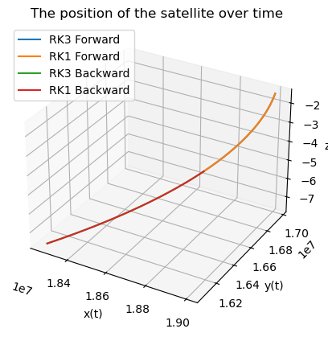

# satellite-navigation-rk
Simulating satellite trajectory using RK1 and RK3 with J2 and Earth rotation

# Satellite Navigation Simulation

This Python script simulates satellite orbital dynamics using RK1 and RK3 integration methods.

## Features
- Accounts for Earth's gravity, J2 harmonic, and rotation
- Forward and backward propagation
- 3D trajectory visualization with Matplotlib

## Requirements
- numpy
- matplotlib

## Run
```bash
python satellite_simulation.py

## Output

Below is a sample 3D visualization of the satellite's trajectory (RK1 and RK3):


